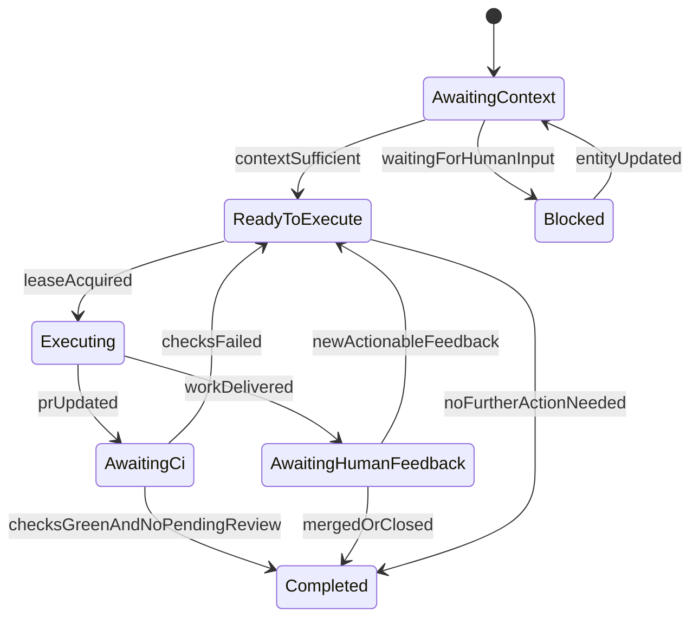

# Agent1 Specification

Status: Draft  
Owner: Agent1 Team  
Last Updated: 2026-03-01

## 1) Purpose

Agent1 is an autonomous GitHub engineering agent designed to be:

- Maintainable by humans and by the agent itself.
- Deterministic in behavior and state transitions.
- Fully observable with radical transparency.
- Safe by policy, configurable by controls, and provable by tests.

This document is the canonical blueprint for architecture, behavior, testing, and delivery.

## 2) Product Goals

- Respond to `@mentions` in issues and pull requests.
- Act on issue assignments, request clarification when context is insufficient, and resume automatically when new context arrives.
- Own full PR follow-up lifecycle for PRs authored by Agent1 until human terminal decision (merged or closed).
- Act as a reviewer for PRs authored by others when review is requested, including multi-round follow-up reviews after new commits.
- Handle realistic PR events: change requests, review comments, CI failures, and bot-originated context.
- Keep a single, correlated transparency stream for GitHub-side and Agent1-side activity.
- Separate human-editable controls (prompts, policies, style, commenting, job rules) from core runtime code.
- Allow dev and prod to run concurrently without duplicate task pickup, while preserving behavior parity across environments.
- Use `Vaquum/Agent1` as the sandbox repository for live development and end-to-end validation workflows.

## 3) Non-Goals (v1)

- General multi-tenant SaaS productization.
- Arbitrary repository admin automation (settings, org-level admin changes).
- Email notification workflows (deferred until needed).

## 4) Required Behavior Scope (v1)

### 4.1 Trigger Types

- Issue mention
- PR mention
- Issue assignment
- PR review request
- PR review comments and change requests
- CI status changes for agent-authored PRs
- New activity on assigned/active entities while jobs are open

### 4.2 Deterministic Outcomes

- Every inbound trigger creates or updates a durable job.
- Every job has explicit terminal conditions.
- Every state transition is logged with correlation identifiers.
- No silent fallback behavior for critical routing decisions.

### 4.3 Hard Rule: Review Comment Replies

If source context is a PR review comment thread, Agent1 must reply in that same thread.

- Must not post a separate top-level PR comment for that response.
- If thread-reply path fails, job transitions to retry/blocked with explicit logs.
- No hidden fallback to a separate message.

### 4.4 PR Role Modes

- `author_mode`:
  - Agent1 authored the PR and drives follow-up implementation work until a human merges or closes.
- `reviewer_mode`:
  - PR is authored by someone else and Agent1 is requested or assigned as reviewer.
  - Agent1 performs review, follows thread updates, and re-reviews after relevant new commits.
- Reviewer terminal conditions:
  - requested review delivered,
  - required follow-up reviews delivered after relevant updates,
  - no pending Agent1 review obligations.

## 5) Architecture

Agent1 uses ports-and-adapters with a dedicated orchestration layer.

```mermaid
flowchart LR
  subgraph githubIngress [GitHubIngress]
    notificationsApi[NotificationsAPI]
    prsScanner[AuthorPrScanner]
    timelineScanner[TimelineScanner]
  end

  subgraph coreEngine [CoreEngine]
    eventNormalizer[EventNormalizer]
    jobOrchestrator[JobOrchestrator]
    entityWatchers[EntityWatchers]
    workflowStateMachine[WorkflowStateMachine]
    taskPlanner[TaskPlanner]
    policyGuard[PolicyGuard]
    commentRouter[CommentRouter]
  end

  subgraph adapters [Adapters]
    githubAdapter[GitHubAdapter]
    codexCliAdapter[CodexCliAdapter]
    workspaceAdapter[WorkspaceAdapter]
  end

  subgraph controlPlane [ControlPlane]
    promptsControl[Prompts]
    policiesControl[Policies]
    stylesControl[Styles]
    commentingControl[CommentingRules]
    jobsControl[JobRules]
    runtimeControl[RuntimeConfig]
  end

  subgraph dataPlane [DataPlane]
    supabasePg[SupabasePostgres]
    sqlalchemyLayer[SqlAlchemy2]
    alembicMigrations[Alembic]
  end

  subgraph observability [Observability]
    otelLayer[OpenTelemetry]
    sentryLayer[Sentry]
    structuredLogs[StructuredLogs]
    eventJournal[EventJournal]
    dashboardApi[DashboardAPI]
  end

  githubIngress --> eventNormalizer
  eventNormalizer --> jobOrchestrator
  jobOrchestrator --> entityWatchers
  entityWatchers --> workflowStateMachine
  workflowStateMachine --> taskPlanner
  taskPlanner --> policyGuard
  policyGuard --> commentRouter
  policyGuard --> codexCliAdapter
  policyGuard --> githubAdapter
  codexCliAdapter --> workspaceAdapter

  workflowStateMachine --> otelLayer
  githubAdapter --> otelLayer
  codexCliAdapter --> otelLayer
  otelLayer --> structuredLogs
  sentryLayer --> structuredLogs
  structuredLogs --> eventJournal
  eventJournal --> sqlalchemyLayer
  sqlalchemyLayer --> supabasePg
  alembicMigrations --> supabasePg
  eventJournal --> dashboardApi

  controlPlane --> taskPlanner
  controlPlane --> policyGuard
  controlPlane --> commentRouter
  controlPlane --> codexCliAdapter
```



## 6) Job-Oriented Runtime Model

### 6.1 Core Concepts

- `Entity`: issue or PR, keyed as `owner/repo#number`.
- `Job`: durable unit of work linked to an entity.
- `SubJob`: child work item (review response, CI fix, clarification round).
- `Watcher`: proactive monitor that keeps entity state fresh until terminal.

### 6.2 Lifecycle



### 6.3 Terminal Conditions

- Issue jobs: closed or explicitly policy-abandoned.
- PR jobs: merged or closed by human decision.
- Review/CI sub-jobs: feedback addressed and checks acceptable by policy.
- Reviewer-mode PR jobs: requested review and follow-up obligations completed, or PR closed by human decision.

### 6.4 Reliability Hardening Controls

- Lease fencing:
  - each lease claim includes monotonic `lease_epoch`,
  - each mutating side effect validates `(job_id, lease_epoch)` against current lease state,
  - stale-owner writes are rejected and logged as lease violations.
- Event ordering and cursors:
  - persist `source_event_id`, `source_timestamp_or_seq`, and `received_at` for each ingress event,
  - process deterministic per-entity high-water cursor order,
  - persist stale/out-of-order events for audit without allowing backward state transitions.
- Transactional outbox:
  - persist side-effect intent atomically with transition commit,
  - dispatch from outbox with attempt history and terminal statuses (`sent`, `confirmed`, `failed`, `aborted`),
  - reconcile uncertain deliveries by idempotency key before retry after restart.
- Watcher liveness:
  - watcher state includes `next_check_at`, `last_heartbeat_at`, `idle_cycles`, `watch_deadline_at`, `checkpoint_cursor`,
  - sweeper reclaims stale watchers and restores from checkpoints,
  - truly stuck watchers transition to explicit operator-required state.

## 7) Behavior Matrix

| Trigger | Entity | Action | Terminal Condition |
|---|---|---|---|
| `@mention` in issue | Issue | Respond or execute requested task | Issue closed or no pending actionable request |
| `@mention` in PR | PR | Respond and/or implement requested changes | PR merged/closed by human decision |
| Assignment on issue | Issue | Execute if clear, otherwise ask for info and watch | Issue closed or escalated policy-abandoned |
| Review requested on non-Agent1-authored PR | PR | Perform reviewer-mode workflow with deterministic output | Review submitted and no pending Agent1 follow-up |
| New commits on reviewed non-Agent1 PR | PR | Re-evaluate review state and deliver follow-up review when needed | No pending Agent1 review obligations |
| Review comment thread update | PR thread | Reply in same thread only | Thread addressed; PR lifecycle continues |
| CI failure on agent PR | PR | Diagnose, patch, push, report | Checks pass or policy-blocked |
| New PR feedback on agent PR | PR | Plan next action and execute | PR merged/closed by human decision |

## 8) Comment Routing Contract

`CommentRouter` chooses exactly one destination per response:

- Issue context -> issue comment stream.
- PR general context -> top-level PR comment stream.
- PR review thread context -> same review thread reply target.

Required metadata for thread replies:

- `thread_id`
- `review_comment_id`
- `path`
- `line`
- `side`

All comment placement decisions are persisted in event records and validated by tests.

## 9) Human Control Plane

All behavior controls are editable without touching core runtime logic.

- `controls/prompts/`: prompt templates and system instructions.
- `controls/policies/`: safety, scope, and allowed operations.
- `controls/styles/`: coding and response style guides.
- `controls/commenting/`: comment routing and formatting rules.
- `controls/jobs/`: lifecycle rules and terminal criteria.
- `controls/runtime/`: poll/scanner/retry/timeouts.

Rules:

- No hardcoded prompt text in engine modules.
- Controls are schema-validated at startup.
- Invalid control config fails fast with clear diagnostics.

## 10) Persistence

Primary database: Supabase Postgres.  
ORM and migrations: SQLAlchemy 2 + Alembic.

Core persisted records:

- `jobs`
- `job_transitions`
- `entities`
- `github_events`
- `action_attempts`
- `audit_runs`
- `comment_targets`

Design principle:

- Mutable state for current job/entity status.
- Append-only immutable event history for replay and audit.

### 10.1 Migration Safety Protocol

- Use expand/contract migration pattern for non-trivial schema changes.
- Split schema introduction, backfill, and cleanup across independent deploy steps.
- Require lock-risk review and documented failback path for high-volume table changes.
- Require pre-migration checks, post-migration verification queries, and compatibility-window validation.
- Block deploy progression and execute documented failback on migration failure.

### 10.2 Idempotency and Outbox Guarantees

- Idempotency key schema is deterministic and includes:
  - `entity_key`,
  - `action_type`,
  - `target_identity`,
  - normalized payload hash,
  - policy version hash.
- Enforce uniqueness on environment/provider/action-scope/idempotency key.
- Replay path returns prior persisted result for existing key and must not re-emit side effects.

## 11) Radical Transparency and Observability

### 11.1 Requirements

- One correlated stream for all significant events.
- Full GitHub-side visibility: observed signals, outbound calls, outcomes.
- Full Agent1-side visibility: planning, policy decisions, state transitions, retries.
- Codex execution visibility: tool lifecycle, timing, exit status, parsed result.

### 11.2 Tooling

- Structured JSON logs.
- OpenTelemetry traces/metrics/log correlation.
- Sentry for exception and failure diagnostics.
- Query-friendly event journal for dashboard and forensic replay.

### 11.3 Standard Event Fields

```json
{
  "timestamp": "2026-03-01T12:00:00Z",
  "environment": "dev|prod|ci",
  "trace_id": "trc_...",
  "job_id": "job_...",
  "entity_key": "owner/repo#123",
  "source": "github|agent|codex|policy|watcher",
  "event_type": "state_transition|api_call|comment_post|execution_result",
  "status": "ok|retry|blocked|error",
  "details": {}
}
```

Secrets must be redacted before persistence.

### 11.4 Alerting and Escalation

- Define severity classes with ownership routing and escalation time targets.
- Alert on:
  - lease violations,
  - duplicate side-effect anomalies,
  - comment-routing failures,
  - outbox backlog growth,
  - elevated failed transition rates.
- Every critical alert links to the relevant runbook and includes correlated `trace_id`/`job_id`.

## 12) Tech Stack (Now vs Later)

### 12.1 Include Now

- Monorepo: pnpm workspaces + Turborepo.
- Frontend: TypeScript strict + Vite.
- Backend: FastAPI (Python).
- Database: Supabase Postgres.
- ORM/Migrations: SQLAlchemy 2 + Alembic.
- Testing: pytest + Vitest + Playwright.
- Observability: structured logs + OpenTelemetry + Sentry.
- Delivery: Docker on Render.

### 12.2 Conditional / Deferred

- Resend email integration (when outbound notifications are actually needed).
- React Testing Library only if frontend uses React components.

### 12.3 Environment Isolation and Authentic Dev

- Environment principle:
  - dev and prod run the same binaries, code paths, contracts, and decision logic.
  - behavior differences must be configuration-only, never code forks.
- Isolation requirements:
  - separate deployment targets for dev and prod,
  - separate persistence namespace (project or strict schema isolation),
  - separate telemetry namespace for logs/traces/alerts,
  - explicit runtime identity (`environment`, `instance_id`).
- Scope and side-effect controls:
  - prod in `active` mode operates only on production scope,
  - dev in `active` mode operates only on sandbox namespace inside `Vaquum/Agent1`,
  - dev observing production scope must run in `shadow` mode (full pipeline, zero writes).
- In-repo partitioning for `Vaquum/Agent1` (required):
  - sandbox marker label namespace (for example `agent1-sandbox`),
  - sandbox branch/PR namespace (for example `sandbox/*`),
  - prod active mode must ignore sandbox-marked entities.
- Safety modes:
  - `active`: writes enabled,
  - `shadow`: no writes, full observability and planning,
  - `dry_run`: local deterministic simulation.
- Duplicate prevention:
  - distributed lease ownership for job claims with heartbeat and TTL,
  - idempotency keys for outbound side effects,
  - side effects require valid lease ownership and allowed scope.
- Authenticity support:
  - optional replay of production-like event shapes into sandbox for realistic dev validation.

### 12.4 Security and Governance Controls

- Identity and credential binding:
  - mutating side effects require credentials bound to expected environment identity,
  - runtime enforces pre-flight `credential_owner == expected_env_identity` before mutating calls,
  - read-only watchers and mutators use separate least-privilege credentials.
- Least-privilege permission matrix:
  - machine-readable matrix by component (`api`, `worker`, `watcher`, `dashboard`, `ci`) and environment (`dev`, `prod`),
  - default-deny capability model for GitHub operations,
  - split persistence roles (`migrator`, `runtime`, `readonly_analytics`) with minimum privileges.
- Policy bypass prevention:
  - protected approval path for policy and guardrail changes,
  - fail-closed behavior when policy resolution is missing or invalid.
- Safe Git operations contract:
  - explicit allowlist for git mutations,
  - hard deny destructive operations (`git push --force`, `git push --force-with-lease`, `git reset --hard`, `git clean -fdx`, branch/tag deletion),
  - restrict mutations to approved branch namespaces (`agent1/*`, `sandbox/*`) and protected branch workflows.
- CI and dependency supply-chain controls:
  - pin CI actions by immutable SHA,
  - enforce least-privilege job tokens,
  - enforce reproducible installs and lockfile integrity checks,
  - enforce dependency vulnerability gates.
- Audit integrity and privacy:
  - append-only tamper-evident chain (`event_seq`, `prev_event_hash`, `payload_hash`),
  - anomaly detection for hash-chain gaps and idempotency violations,
  - retention and purge policies for logs, traces, and test artifacts.

## 13) Testing Strategy

### 13.1 Test Layers

- Backend unit/integration: `pytest`.
- Frontend unit: `Vitest`.
- Browser and E2E: `Playwright`.
- Live GitHub scenarios: sandbox workflows in `Vaquum/Agent1`.

### 13.2 Required Scenario Coverage

- Issue mention response.
- PR mention response.
- Assignment with direct execution.
- Assignment clarification loop and resume.
- Review request flow on non-Agent1-authored PRs.
- Reviewer follow-up after new commits on non-Agent1-authored PRs.
- Change request follow-up.
- CI failure detection and fix.
- Bot-originated review context handling.
- Review-thread in-place reply behavior.
- Self-trigger loop prevention.
- Multi-round PR lifecycle until merge/close.
- Concurrent prod+dev runtime isolation with no duplicate side effects.
- Shadow mode correctness (full processing visibility with zero GitHub writes).
- In-repo sandbox marker enforcement within `Vaquum/Agent1`.

### 13.3 Deterministic Assertions

- Correct job graph creation and transitions.
- Correct comment target type and thread identity.
- Correct PR/issue side effects and status.
- Correct audit/event trace completeness.

## 14) CI Gates

### 14.1 PR Gates

- TypeScript strict typecheck.
- Python typecheck.
- Ruff and lint checks.
- Unit/integration tests.
- PR E2E smoke suite.

### 14.2 Nightly Gates

- Full E2E scenario suite on `main`.

### 14.3 Environment Safety Gates

- Validate environment config parity for shared contracts.
- Validate non-overlapping active scopes across dev/prod.
- Validate shadow-mode write guard behavior.

### 14.4 Operational Readiness Gate

- Production release requires:
  - current runbooks,
  - tested alert routing,
  - rollback rehearsal evidence.
- CI verifies operational-readiness artifacts before release promotion.

### 14.5 Service Levels and Error Budget Policy

- Define SLOs for:
  - trigger-to-first-action latency,
  - side-effect success rate,
  - duplicate side-effect rate,
  - mean-time-to-recovery for critical incidents.
- Track error budget burn and slow or freeze releases on budget exhaustion.
- Exception to error-budget policy requires explicit human approval and mitigation plan.

No merge is complete without green required gates.

## 15) Deployment

- Dockerized deployment to Render.
- Environment-specific runtime config for test/sandbox/prod.
- Alembic migration step integrated into release workflow.
- Separate dev/prod services with explicit environment identity and scope policy.
- Runtime guard must reject startup when active scopes overlap with another active environment definition.

### 15.1 Progressive Rollout and Rollback Policy

- Rollout is progressive and checkpointed by health signals.
- Stop-the-line triggers include severe error-rate increases, lease-violation spikes, duplicate side effects, and policy enforcement failures.
- Rollback path includes:
  - immediate containment by mode downgrade (`active` -> `shadow`),
  - artifact rollback to last known good version,
  - migration failback path when required by compatibility.
- Return to normal rollout only after smoke scenarios and critical SLO checks pass.

### 15.2 Incident Response Lifecycle

- Define severity levels with response-time targets and ownership routing.
- Sev1/Sev2 incidents require incident commander assignment and communication cadence.
- Post-incident review requires root cause, permanent corrective actions, and due dates.
- Corrective actions must feed into tests, controls, and runbooks in subsequent changes.

## 16) Monorepo Layout

```text
Agent1/
  spec.md
  docs/
  docs/Developer/
  controls/
  apps/
    backend/
    frontend/
  tests/
    unit/
    integration/
    live/
    scenarios/
  pnpm-workspace.yaml
  turbo.json
  package.json
```

## 17) Development Guideline (Mandatory for Every Change)

Every change must include all items below:

- Define behavior delta and expected state transitions first.
- Update controls when behavior rules change.
- Update typed contracts and migrations when schema/model changes.
- Add/update deterministic tests at the right layer.
- Update live scenario coverage when external behavior changes.
- Add observability coverage for new paths with secret redaction.
- Preserve in-thread PR review reply contract.
- Verify environment isolation invariants for changes touching ingestion, orchestration, or side effects.
- Update `docs/` for user-visible behavior/config/operations changes.
- Update `docs/Developer/` for architecture/workflow/testing/internal changes.
- Run local quality gates before PR.
- Attach PR evidence (tests, key traces, transition proof).
- Update this spec when architecture or core behavior changes.

A change is not complete until checklist items are satisfied and CI passes.

## 18) Documentation Maintenance Policy

- `docs/` is the user-facing documentation source of truth.
- `docs/Developer/` is the developer-facing documentation source of truth.
- Docs must be updated in the same change that modifies behavior or expectations.
- Documentation drift is treated as a quality failure.

### Required Runbook Set

- `docs/Developer/runbooks/deploy-and-rollback.md`
- `docs/Developer/runbooks/migration-failback.md`
- `docs/Developer/runbooks/lease-and-idempotency-incidents.md`
- `docs/Developer/runbooks/review-thread-routing-failures.md`
- `docs/Developer/runbooks/github-rate-limit-and-token-failures.md`

## 19) Delivery Phases

1. Author and lock `spec.md`.
2. Scaffold monorepo and app boundaries.
3. Implement core contracts and control schemas.
4. Implement persistence (SQLAlchemy + Alembic + Supabase).
5. Implement orchestrator, watchers, and state machine.
6. Implement GitHub adapter and comment router.
7. Implement Codex CLI adapter and executor pipeline.
8. Implement transparency stack (logs + OTel + Sentry + event journal).
9. Implement scenario harness and CI gates.
10. Implement operations dashboard.
11. Harden resilience, docs parity, release process, and incident readiness.

## 20) Acceptance Criteria

- All required scenarios are automated and passing.
- PR review thread replies are always in-thread and verifiable.
- Every significant action is visible in one correlated transparency stream.
- Jobs are tracked deterministically to terminal states.
- CI gates are reliable and enforced.
- `docs/` and `docs/Developer/` remain current with each merged change.
- Dev and prod can run concurrently without duplicate task handling on the same trigger.
- Dev behavior remains authentic to prod through shared logic and configuration-only separation.
- Live sandbox execution is pinned to `Vaquum/Agent1` with enforced non-overlapping in-repo sandbox markers.
- Reliability controls (lease fencing, event ordering, idempotency, outbox recovery, watcher liveness) are implemented and tested.
- Security/governance controls are enforceable via policy, CI, and runtime checks.
- Rollback, incident response, alerting, runbooks, and SLO/error-budget policy are active and operationally validated.

## 21) Plan-to-Spec Parity Checklist

- Product goals align with human-owned merge/close semantics.
- Reviewer mode for non-Agent1-authored PRs is first-class in behavior and tests.
- Reliability hardening controls match plan requirements.
- Security and governance controls match plan requirements.
- Operability controls (migration safety, rollback, incident response, SLO/error budget, runbooks) match plan requirements.
